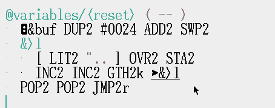
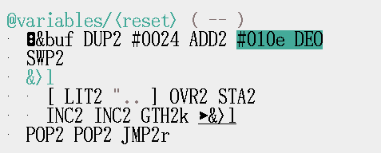

# Debugging
```
case XK_F2: emu_deo(0xe, 0x1); break;
```
[uxn11.c#L1145](https://git.sr.ht/~rabbits/uxn11/tree/main/item/src/uxn11.c#L1145)

You can write the following, no need for anything else.
```
#1234 #010e DEO BRK
```
assemble that
```
a012 34a0 010e 17
```
the magic debug bytes.


Say you're working on the variables cleanup routine in orca and want to get the result of the buf + 0x24

add a debug point as highlighted above.

```
WST 00 00|01 6e 00 59 00 7d <06
RST 00 00 00 00|03 44 09 01 <04
```
the debugger indicates the result is 0x7d

Hitting F2 (in a emulator with support) will execute debug and print the stacks.
```
WST 00 00 00 00 00 00 00 00|<
RST 00 00 00 00 00 00 00 00|<
```
the stack should be clean when executing; this is a good sign.

cardinal added:
```
self.dev.system.debug(&mut self.vm);
```
and
```
    pub fn deo_helper(&mut self, dev: &mut dyn Device, port: u8, value: u8, pc: u16) {
        self.stack_mut().push_byte(value);
        self.stack_mut().push_byte(port);
        let _ = self.deo::<0b000>(dev, pc);
    }
    self.vm.deo_helper(&mut self.dev, 0xe, 0x1, 0x100);
```
the helper is going away; this personal computing stack changes; api is subject to change!

 uxn32, stops evaluation after a breakpoint(#010e DEO) and lets you step.
 cardinal does not currently support stepping, maybe something for the future.