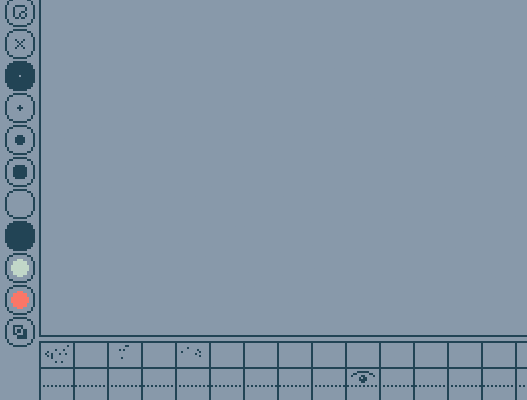

# Mouse and Tracker Device Duplication in Uxn Assembly


## Overview

Please refer to [Commit c75fa72](https://github.com/davehorner/cardinal/commit/c75fa7232e22c5730470a91343cf4f59aab83311); this is temporary.

```
|f0 @Tracker/vector $2 &x $2 &y $2 &state $1 &pad $3 &sx $2 &sy $1 &sy-lb $1
```

Todays side quest is a varvara device.  A second mouse device called Tracker.  The code is simply the mouse.rs renamed to tracker and all references and usage patterns matched.  The rust code adds a 16px offset to the new Tracker mouse so that you can see the tracker draw in addition to the normal Mouse device.  The task of hooking up the new device is very straight forward.  Then comes the uxn tal.

We could emulate or offset using tal directly.
```
.Mouse/x DEI2 #0010 ADD2 .Screen/x DEO2
```
16 pixels to the right of the mouse position.

```
.Tracker/x DEI2 .Screen/x DEO2
.Tracker/y DEI2 .Screen/y DEO2
```
Plot a point on the screen where Tracker's x,y is pointing.

Modified flick.tal.txt to do this drawing.

This document describes the process and rationale for duplicating Mouse device logic for a new Tracker device in the Uxn assembly codebase, specifically in `tracker.tal`. The goal was to support both Mouse and Tracker devices in parallel, ensuring identical event handling and interaction logic for each, without losing Mouse support.

## Motivation
- Enable parallel input from both Mouse and Tracker devices.
- Maintain legacy Mouse functionality while introducing Tracker.
- Learn something.

## Steps Taken
1. **Device Vector Duplication**
   - Duplicated all Mouse device vectors and event handlers for Tracker.
   - Ensured both devices have their own state, coordinates, and event logic.

2. **Symbol Collision Resolution**
   - Renamed symbols that conflicted (e.g., `&last` for Mouse and Tracker) to unique names (`&last-tracker`).

3. **Symbol Reference Distance Fixes**
   - Moved key zero-page variable definitions (e.g., `@scene/x`, `@scene/y`, `,&x`, `,&y`) to the top of the file to ensure all references are within range for Uxn assembly.

4. **Event Handler Duplication**
   - Duplicated all event handling logic for Mouse to Tracker, including window, scene, and pane sections.
   - Ensured both devices trigger identical logic paths and UI updates.

5. **Testing and Validation**
   - Verified that both Mouse and Tracker devices operate independently and in parallel.
   - Confirmed no symbol reference or collision errors remain.

## Outcome
- Both Mouse and Tracker devices are now fully supported in the Uxn assembly codebase.
- Two mice.
- More questions about `Reference too far: scene/y in meta`

## Notes
- Careful symbol placement is critical in Uxn assembly due to reference distance constraints.
- Device logic duplication should always ensure unique symbol names to avoid collisions.
- This approach can be extended to additional input devices.
- [varvara](https://wiki.xxiivv.com/site/varvara.html)
- [flick.tal.txt](https://wiki.xxiivv.com/etc/flick.tal.txt) original source for tracker.tal
- [~rabbits/uxn/examples/devices](https://git.sr.ht/~rabbits/uxn/tree/main/item/projects/examples/devices)
- [davehorner/cardinal/cardinal-varvara/src](https://github.com/davehorner/cardinal/tree/main/cardinal-varvara/src)
- [uxntal_notation](https://wiki.xxiivv.com/site/uxntal_notation.html)

*Last updated: July 26, 2025*
David Horner
