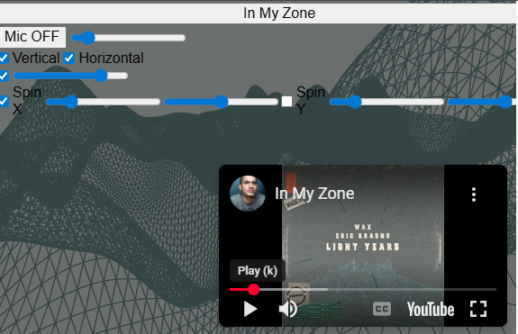
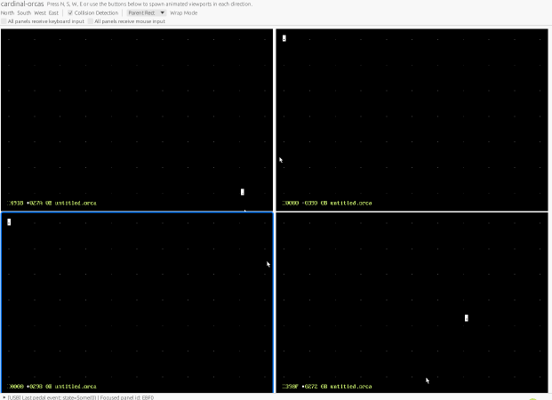

# cardinal's HID USB Controller

[](https://codepen.io/Dave-Horner/pen/LEPXRqo)

Right click the above image and open in new window.  Click the `In My Zone` button.  Click the red youtube play.
Click `Mic OFF` to see the your volume level modify the scene.  Continue reading.

## Overview

This document describes the process and rationale for building a varvara controller abstraction for HID USB devices (such as pedals and custom controllers).

This `controller_usb.rs` was developed with the intention of reusing the existing `controller.rs`.  The USB controller is a default feature and a VEC foot pedal should just work.


Using a different device is as simple as changing the default or passing a new config.

```rust
        UsbDeviceConfig {
            vendor_id: 0x05f3,
            product_id: 0x00ff,
        }
```

`controller_usb` is cross-platform and should work on windows, linux, and macos.  Thanks to [hidapi-rs](https://github.com/ruabmbua/hidapi-rs).
The controller is part of `cardinal-varvara` and `cardinal-gui` takes it on as a dependency and performs the mapping just as the other devices.


Quickly lets describe the running with and without the usb controller.  I like a `uses_` prefix for feature flags controlling dependencies. 

### Building **with** `uses_usb`
Ensure the `uses_usb` feature is enabled (default or explicitly `--features uses_usb`):

```sh
cargo run --bin cardinal-orcas
```
This is the default for cardinal-varvara and cardinal-gui.

### Building **without** `uses_usb`
Disable the `uses_usb` feature to exclude USB-specific code:

```sh
cargo run --bin cardinal-orcas --no-default-features
```

## Motivation
- Maintain legacy controller support while introducing new usb input devices.
- Have fun and make something useful.

The only software that uses this controller is `cardinal-orcas`.  I have not yet done any tal interfacing; the mapping is done in rust.

`cardinal-orcas` displays a grid of orca.



When running, you'll see a grid of Uxn panels, each representing a separate VM instance. The USB pedal (or other HID device) can be used to cycle focus between these panels, enabling hands-free switching. The selected panel is highlighted, and pedal presses are mapped to panel navigation or custom actions as configured.

Below the grid, USB device information is displayed for reference. When you press different pedal switches, the currently selected Uxn panel updates accordingly. The active Orca panel is visually highlighted with a blue rectangle outline, making it easy to identify which panel is selected.

feat(gui): add USB pedal support and uxn panel grid to cardinal-orcas

- Add `uses_usb` feature to `cardinal-gui` and `cardinal-varvara` for optional USB pedal integration using `hidapi`
- Implement `UxnPanel` for rendering and interacting with multiple Uxn VMs in a grid
- Add focus handling, panel switching via Tab and pedal input
- Support `.sym` symbol file loading for vector labeling and debug tracing
- Refactor `Stage` to centralize input and rendering logic
- Update `Varvara` to support controller trait abstraction and pedal injection
- Switch from `Varvara::new()` to `Varvara::default()` in CLI and GUI
- Patch crates.io dependencies locally for `cardinal-varvara` and `cardinal-uxn`


## About `controller_device.rs`

The `controller_device` module serves as a foundational abstraction for all controller types, including USB, simulated, and passthru devices. It defines the core `ControllerDevice` trait, which standardizes the interface for reading input events, managing layers, and handling device-specific configuration.

By implementing `ControllerDevice` for each backend (such as `controller_usb`), the system ensures that new controller types can be integrated with minimal changes to the rest of the codebase. This trait-based approach also allows for easy testing and extension, as simulated devices or mock controllers can be swapped in during development.

Key responsibilities of `controller_device` include:
- Defining the trait for controller input/output.
- Providing common types for events, actions, and configuration.
- Enabling polymorphic handling of different controller backends.
- Supporting event pipelines and chaining by exposing a unified interface.

This modular design makes it straightforward to add support for new hardware or input methods, and underpins the flexible layering and remapping features planned for the future.

## Future things
- Enable flexible remapping and layering for USB controllers (pedals, buttons, etc.).
- Support dynamic layer switching and macro actions.
- Allow chaining of controller backends for event transformation and passthrough.
- Condense and document trait abstraction for controller input/output.
- Implement and document multi-layer system with dynamic switching.
- Refine state machine for tracking layers, inputs, and modifiers.
- Expand event pipeline for chaining and passthrough support.
- Enhance configurable actions and macro mapping.
- Improve testing to ensure legacy and new controller logic coexist.


## Outcome
- USB pedal support via hidapi-rs
- Unified ControllerDevice trait for flexible input backends
- .sym file support for runtime vector labeling
- Foundation for further input device experimentation and extension.

## Notes
- Arrow keys are working.  Normal letters and numbers are not working in `cardinal-gui` and injecting mouse for all uxn panels is also not working!

*Last updated: July 28, 2025*
David Horner
