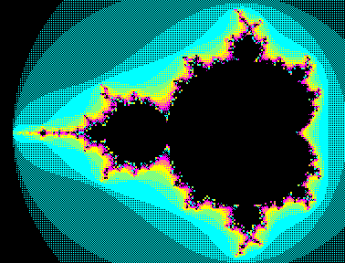
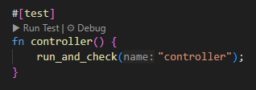

# Varvara Hardware Verification Test Results




`cardinal-varvara\tests` is the the result of a hardware verification.  A test will produce a `.failed.png` when things go awry.

## Summary

This document summarizes the results of running `cargo test --release --verbose` for the current state of the `cardinal` project. All test failures and errors are listed below for hardware verification and regression tracking.  cardinal `controller_usb` is brand new and is affecting the 3 tests.

Today was time spent clearing clippy lints and improving code quality.  There were more than 30 builds performed and more than 100 issues considered/resolved.

Failing a build is typically a bad thing.  In this case, its good fortune.  I learned about these great scripts!

[Raven](https://github.com/mkeeter/raven) came with a powerful set of tests.  These tests allow you to find issues like a controller sending an errant key or messing state that it shouldn't.

## Test Results (as of 2025-07-28)

### Test run: `cargo test --release --verbose`

**Summary:**

- All core and GUI binaries built and ran with no test failures (0 tests).
- `cardinal-uxn` ran 37 tests: **all passed**.
- `cardinal-varvara` ran 9 snapshot tests: **6 passed, 3 failed**.

**Failures:**

```sh
cargo.EXE test --package cardinal-varvara --test snapshots -- snapshots::controller --exact --show-output
    Finished `test` profile [unoptimized + debuginfo] target(s) in 0.09s
     Running tests\snapshots.rs (target\debug\deps\snapshots-3c17c623fe386d3d.exe)

running 1 test
test snapshots::controller ... FAILED

successes:

successes:

failures:

---- snapshots::controller stdout ----
[USB] Starting HID thread, attempting to create API instance...
[USB] Starting HID thread, attempting to create API instance...
Pressed key: Right
Processing event: Event { data: None, vector: 377 }
[VARVARA][process_event] vector: 0x0179 [unknown], data: None
Pressed key: Char(97)
[USB] HID API instance created. Attempting to open device 05f3:00ff...
[USB] Device opened successfully.
[USB] HID API instance created. Attempting to open device 05f3:00ff...
[USB] Device opened successfully.

thread 'snapshots::controller' panicked at cardinal-varvara\tests\snapshots.rs:111:13:
image mismatch in controller, saved to "C:\\w\\cardinal\\cardinal-varvara\\tests/controller.failed.png"
stack backtrace:
   0: std::panicking::begin_panic_handler
             at /rustc/6b00bc3880198600130e1cf62b8f8a93494488cc/library\std\src\panicking.rs:697
   1: core::panicking::panic_fmt
             at /rustc/6b00bc3880198600130e1cf62b8f8a93494488cc/library\core\src\panicking.rs:75
   2: snapshots::run_and_check
             at .\tests\snapshots.rs:111
   3: snapshots::snapshots::controller
             at .\tests\snapshots.rs:130
   4: snapshots::snapshots::controller::closure$0
             at .\tests\snapshots.rs:129
   5: core::ops::function::FnOnce::call_once<snapshots::snapshots::controller::closure_env$0,tuple$<> >
note: Some details are omitted, run with `RUST_BACKTRACE=full` for a verbose backtrace.


failures:
    snapshots::controller

test result: FAILED. 0 passed; 1 failed; 0 ignored; 0 measured; 8 filtered out; finished in 0.25s

error: test failed, to rerun pass `-p cardinal-varvara --test snapshots`
```


- `snapshots::piano` — image mismatch, see `cardinal-varvara/tests/piano.failed.png`
- `snapshots::controller` — image mismatch, see `cardinal-varvara/tests/controller.failed.png`
- `snapshots::audio` — image mismatch, see `cardinal-varvara/tests/audio.failed.png`

All three failures are snapshot image mismatches. See the referenced `.failed.png` files for visual diffs.

### Failed Snapshot Images

| Test Name               | Snapshot Image                                              |
|-------------------------|-------------------------------------------------------------|
| `snapshots::piano`      |                        |
| `snapshots::controller` |              |
| `snapshots::audio`      |                        |

No other test failures or panics were observed. All other snapshot and opcode tests passed.

These results were consistent across all the different test platforms. windows, macos, linux, and it seems wasm is excluded.

This is really a wonderful surprise.  I will disable these tests from running to get the current state of the world in tree and on crates.io.
Future PRs and notes to follow.

Also, while I'm telling you I'm turning off tests to make a release; I should also let you know that I allowed:

```rust
            #[allow(static_mut_refs)]
            let ram: &'static mut [u8; 65536] = unsafe { &mut RAM };
```

forgive me 65536 bytes.

---
**Last updated:** 2025-07-28
David Horner